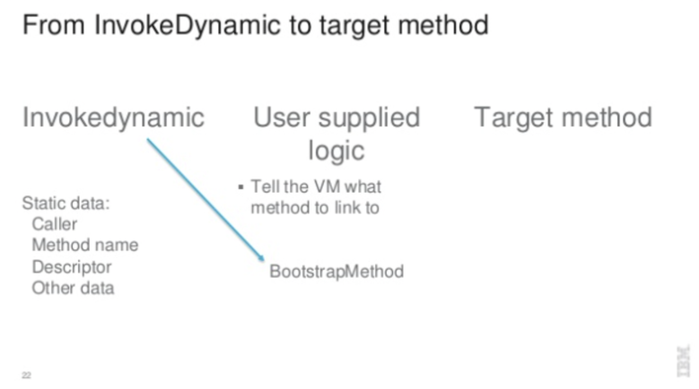
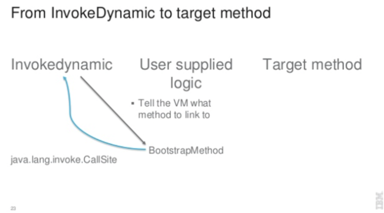
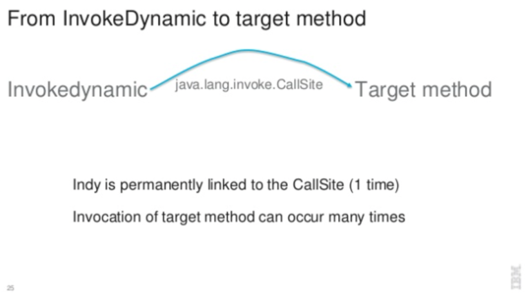

## 아이템 3. 생성자나 열거 타입으로 싱글턴임을 보증하라

### 1) 포스팅 정리
[아이템 3. 생성자나 열거 타입으로 싱글턴임을 보증하라](https://devfunny.tistory.com/528)

### 제네릭 Scope
```java
class Box<T> {
    private T t;

    public void add(T t) {
        this.t = t;
    }
    
    public T get() {
        return this.t;
    }
}
```
- Box<T>
  - 인스턴스 변수, 메서드에 적용 가능하다.
- static 변수, static 메서드에는 제네릭 적용이 불가능하다.
  - 클래스가 인스턴스가 되기 전에 static은 메모리에 미리 올라가기 때문에 static 변수/메서드의 T 타입이 정해질 수 없다.

```java
class Box<T> {
    private static T T; // 컴파일 에러
    
    // 제네릭 메서드
    // 제네릭 메서드는 호출시에 타입을 지정하기 때문에 static이 가능하다.
    public static <T> T method(T t) {  // Box의 T와는 다른 타입
        return t;
    }
}
```

- 클래스에 지정된 타입 파라미터와 제네릭 메서드에 정의된 타입 파라미터는 상관이 없다
  - 즉, 제네릭 클래스에 <T>를 사용하고, 같은 클래스의 제네릭 메서드에도 <T>로 같은 이름을 가진 타입 파라미터를 사용하더라도 둘은 전혀 상관이 없다

```java
class Box<T> {
    private T t;

    // 반환값이 T타입이거나 void라면 파라미터로 클래스에 선언한 T타입 외의 다른 제네릭 타입을 받을 수 없다.
    public void set(T t) {  
        this.t = t;
    }
    
    public void set(A a) { // 컴파일 에러
        this.t = a;
    }
    
    // 반환값은 클래스에 선언한 T 타입과 동일
    public List<T> getT() {
        return new ArrayList<>();
    }

    // <T> 타입으로 새로 선언한 타입
    // 클래스와 선언한 T타입과는 다른 타입
    public <T> List<T> getWho(T t) {
        return new ArrayList<>();
    }
    
    // static 메소드는 반드시 타입을 명시
    public static <T> T get(T t) {
        return t;
    }
}
```

### Understanding Java method invocation with invokedynamic, LambdaMetaFactory
#### 익명클래스 vs 람다

#### 익명클래스

1) 익명클래스 예제
```java
public class AnonymousClass {
    public static void main(String[] args) {
        IntBinaryOperator plus = new IntBinaryOperator() {
            @Override
            public int applyAsInt(int left, int right) {
                return left + right;
            }
        };
    }
}
```

2) 바이트 코드
```
public class com/whiteship/white_ship_study/week15/AnonymousClass {
  static INNERCLASS com/whiteship/white_ship_study/week15/AnonymousClass$1 null null

  public static main([Ljava/lang/String;)V
   L0
    LINENUMBER 8 L0
    NEW com/whiteship/white_ship_study/week15/AnonymousClass$1
    DUP
    INVOKESPECIAL com/whiteship/white_ship_study/week15/AnonymousClass$1.<init> ()V
    ASTORE 1
   L1
    LINENUMBER 14 L1
    RETURN
   L2
    LOCALVARIABLE args [Ljava/lang/String; L0 L2 0
    LOCALVARIABLE plus Ljava/util/function/IntBinaryOperator; L1 L2 1
    MAXSTACK = 2
    MAXLOCALS = 2
}
```

- 익명 클래스는 static 중첩 클래스로 새로운 AnonymousClass 를 생성하고 있다.
```
static INNERCLASS com/whiteship/white_ship_study/week15/AnonymousClass$1
```

- INVOKESPECIAL 을 통해 AnonymousClass$1 의 클래스의 객체를 생성한다.
```
INVOKESPECIAL com/whiteship/white_ship_study/week15/AnonymousClass$1.<init> ()V
```

#### 람다식

1) 람다식 예제
```java
public class LambdaEx {
    private IntBinaryOperator plus() {
        IntBinaryOperator plus = (x, y) -> {
            return x + y;
        };
        return plus;
    }
}
```

2) 바이트코드
```
// class version 52.0 (52)
// access flags 0x21
public class com/whiteship/white_ship_study/week15/NotAnonymous {

  // compiled from: NotAnonymous.java
  // access flags 0x19
  public final static INNERCLASS java/lang/invoke/MethodHandles$Lookup java/lang/invoke/MethodHandles Lookup

  // access flags 0x2
  private plus()Ljava/util/function/IntBinaryOperator;
   L0
    LINENUMBER 12 L0
    INVOKEDYNAMIC applyAsInt()Ljava/util/function/IntBinaryOperator; [
      // handle kind 0x6 : INVOKESTATIC
      java/lang/invoke/LambdaMetafactory.metafactory(Ljava/lang/invoke/MethodHandles$Lookup;Ljava/lang/String;Ljava/lang/invoke/MethodType;Ljava/lang/invoke/MethodType;Ljava/lang/invoke/MethodHandle;Ljava/lang/invoke/MethodType;)Ljava/lang/invoke/CallSite;
      // arguments:
      (II)I, 
      // handle kind 0x6 : INVOKESTATIC
      com/whiteship/white_ship_study/week15/NotAnonymous.lambda$plus$0(II)I, 
      (II)I
    ]
    ASTORE 1
   L1
    LINENUMBER 15 L1
    ALOAD 1
    ARETURN
   L2
    LOCALVARIABLE this Lcom/whiteship/white_ship_study/week15/NotAnonymous; L0 L2 0
    LOCALVARIABLE plus Ljava/util/function/IntBinaryOperator; L1 L2 1
    MAXSTACK = 1
    MAXLOCALS = 2

  // access flags 0x100A
  private static synthetic lambda$plus$0(II)I
    // parameter synthetic  x
    // parameter synthetic  y
   L0
    LINENUMBER 13 L0
    ILOAD 0
    ILOAD 1
    IADD
    IRETURN
   L1
    LOCALVARIABLE x I L0 L1 0
    LOCALVARIABLE y I L0 L1 1
    MAXSTACK = 2
    MAXLOCALS = 2
}
```

- 위 익명클래스와 다르게, 클래스를 별도로 생성하는 코드는 없다. 대신, 메서드를 생성한다.
  - INVOKEDYNAMIC 키워드
  - LambdaMetafactory.metafactory()에 MethodHandles$Lookup, MethodType, MethodHandle 등을 인자를 넣어서 처리한다.
  - Callsite 라는 키워드도 보인다.

```
INVOKEDYNAMIC applyAsInt()Ljava/util/function/IntBinaryOperator; [
      // handle kind 0x6 : INVOKESTATIC
      java/lang/invoke/LambdaMetafactory.metafactory(Ljava/lang/invoke/MethodHandles$Lookup;Ljava/lang/String;Ljava/lang/invoke/MethodType;Ljava/lang/invoke/MethodType;Ljava/lang/invoke/MethodHandle;Ljava/lang/invoke/MethodType;)Ljava/lang/invoke/CallSite;
      // arguments:
      (II)I, 
      // handle kind 0x6 : INVOKESTATIC
      com/whiteship/white_ship_study/week15/NotAnonymous.lambda$plus$0(II)I, 
      (II)I
    ]
```

- private static으로 plus 메서드가 자동 생성되었다.
```
private static synthetic lambda$plus$0(II)I
```

3) 람다식을 이용한 구현 + 외부 참조
```java
public class LambdaEx {
  private IntBinaryOperator plus() {
    IntBinaryOperator plus = (x, y) -> {
      System.out.println(this);
      return x + y;
    };
    return plus;
  }
}
```

4) 3)번의 바이트코드
```
// class version 52.0 (52)
// access flags 0x21
public class com/whiteship/white_ship_study/week15/NotAnonymous {

  // compiled from: NotAnonymous.java
  // access flags 0x19
  public final static INNERCLASS java/lang/invoke/MethodHandles$Lookup java/lang/invoke/MethodHandles Lookup

  // access flags 0x2
  private plus()Ljava/util/function/IntBinaryOperator;
   L0
    LINENUMBER 12 L0
    ALOAD 0
    INVOKEDYNAMIC applyAsInt(Lcom/whiteship/white_ship_study/week15/NotAnonymous;)Ljava/util/function/IntBinaryOperator; [
      // handle kind 0x6 : INVOKESTATIC
      java/lang/invoke/LambdaMetafactory.metafactory(Ljava/lang/invoke/MethodHandles$Lookup;Ljava/lang/String;Ljava/lang/invoke/MethodType;Ljava/lang/invoke/MethodType;Ljava/lang/invoke/MethodHandle;Ljava/lang/invoke/MethodType;)Ljava/lang/invoke/CallSite;
      // arguments:
      (II)I, 
      // handle kind 0x7 : INVOKESPECIAL
      com/whiteship/white_ship_study/week15/NotAnonymous.lambda$plus$0(II)I, 
      (II)I
    ]
    ASTORE 1
   L1
    LINENUMBER 16 L1
    ALOAD 1
    ARETURN
   L2
    LOCALVARIABLE this Lcom/whiteship/white_ship_study/week15/NotAnonymous; L0 L2 0
    LOCALVARIABLE plus Ljava/util/function/IntBinaryOperator; L1 L2 1
    MAXSTACK = 1
    MAXLOCALS = 2

  // access flags 0x1002
  private synthetic lambda$plus$0(II)I
    // parameter synthetic  x
    // parameter synthetic  y
   L0
    LINENUMBER 13 L0
    GETSTATIC java/lang/System.out : Ljava/io/PrintStream;
    ALOAD 0
    INVOKEVIRTUAL java/io/PrintStream.println (Ljava/lang/Object;)V
   L1
    LINENUMBER 14 L1
    ILOAD 1
    ILOAD 2
    IADD
    IRETURN
   L2
    LOCALVARIABLE this Lcom/whiteship/white_ship_study/week15/NotAnonymous; L0 L2 0
    LOCALVARIABLE x I L0 L2 1
    LOCALVARIABLE y I L0 L2 2
    MAXSTACK = 2
    MAXLOCALS = 3
}
```

- this 객체를 사용함으로써 달라진 점이 있다.
  - 람다식은 새로운 메서드로 볼 수 있으며, 메서드에서 this 는 메서드 를 가진 클래스를 의미한다.
  - 따라서 람다식에서 this 는 람다를 포함하는 클래스의 인스턴스이다.

```
System.out.println(this);
```

- this 를 사용하는 람다는 static 이 아닌 lambda&plus$0 을 생성한다.
- this 라는 인스턴스는 static 이 아니기 때문이다.
  - (참고) this는 현재 객체(instance)를 가리키는 참조 변수로, this는 인스턴스 메서드 내부에서만 사용 가능하다.

```
private plus()Ljava/util/function/IntBinaryOperator;
```

#### 익명클래스 vs 람다식 의 결론
- 익명 내부 클래스는 새로운 클래스를 생성하지만, 람다는 새로운 메서드를 생성하여 포함한다.
- 익명 내부 클래스의 this는 새로 생성된 클래스다.
- 람다의 this는 람다식을 포함하는 클래스(생성된 메서드가 존재하는 클래스)다.

#### 바이트코드의 INVOKE ~
기본적으로 JAVA7의 INVOKEDYNAMIC 이 나오기전의 INVOKE~는 아래와 같이 존재했다.
- invokevirtual - instance 메서드를 실행하기 위한 명령어 opcode.
- invokestatic - static 메서드를 실행하기 위한 명령어 opcode.
- invokeinterface - 인터페이스를 통해서 메서드를 실행하기 위한 명령어 opcode.
- invokespecial - 생성자, 수퍼클래스, private method 등 invoke-virtual이 아닌 메서드들을 실행하기 위한 명령어 opcode.

바이트코드의 INVOKE~ opcode 뒷부분에는 아래와 같은 것들이 컴파일타임에 해석되어 명시되어 있으며, 런타임에는 이 정보들로 메서드들을 실행만하는 것이다.
- 메소드의 이름
- 메소드 시그니처 + 반환타입
- 메소드가 정의되어 있는 클래스정보
- 메소드를 실행할 수 있는 바이트코드

#### JAVA 7 의 INVOKEDYNAMIC의 등장
위에서 설명한 INVOKE~들은 어떤 메서드를 실행할지에 대한 정보가 컴파일 타임에 모두 정해져서 바이트코드에 명시된다.
이와달리, JAVA7의 INVOKEDYNAMIC는 컴파일 타임이 아닌 `런타임`에 어떤 메서드를 실행할지 결정하기 위해 등장했다.

INVOKEDYNAMIC 호출을 위해서는 세가지 정보가 필요하다.

- Bootstrap method : invokedynamic 호출이 처음으로 발생할 때 호출되는 메서드로, 호출할 메서드를 결정하기 위해 호출됩니다.
- 정적 파라미터 목록 : 호출될 메서드의 매개변수 중 상수값이나 상수식으로 정의된 인자들
- 동적 파라미터 목록 : 호출될 메서드의 매개변수 중 런타임 시점에 동적으로 계산되는 인자들

> 람다의 바이트코드
```
public class SimpleLambda {  
    public static void main(String[] args) {
        Runnable lambda= invokedynamic(
            bootstrap=LambdaMetafactory,
            staticargs=[Runnable, lambda$0],
            dynargs=[]);
        lambda.run();
    }
    private static void lambda$0() {
        System.out.println(1);
    }
}
```

1) bootstrap=LambdaMetafactory
LambdaMetafactory 의 metafactory() 를 자동으로 호출하는데, 이것이 bootstrap 메서드이다.
```
 public static CallSite metafactory(MethodHandles.Lookup caller,
                                       String invokedName,
                                       MethodType invokedType,
                                       MethodType samMethodType,
                                       MethodHandle implMethod,
                                       MethodType instantiatedMethodType)
            throws LambdaConversionException {
    AbstractValidatingLambdaMetafactory mf;
    mf = new InnerClassLambdaMetafactory(caller, invokedType,
                                         invokedName, samMethodType,
                                         implMethod, instantiatedMethodType,
                                         false, EMPTY_CLASS_ARRAY, EMPTY_MT_ARRAY);
    mf.validateMetafactoryArgs();
    return mf.buildCallSite();
}
```

2) 여러가지 메서드 타입에 대한 정보를 가지고 CallSite 객체를 받는다.
- CallSite 객체 : 동적으로 생성된 람다 표현식의 호출 지점을 나타내는 객체

3) CallSite 클래스
```java
abstract
public class CallSite {

    // The actual payload of this call site:
    /*package-private*/
    MethodHandle target;    // Note: This field is known to the JVM.  Do not change.
    
    //...
}
```

CallSite 객체는 런타임에 람다 표현식을 호출하기 위한 메서드 핸들(MethodHandle)을 담고 있으며, 
이 메서드 핸들은 람다 표현식의 구현을 나타내는 메서드에 연결된다. 
런타임에 CallSite 객체가 람다 표현식의 호출을 수행할 때, 이 메서드 핸들을 사용하여 람다 표현식을 실행한다.

staticargs=[Runnable, lambda$0]는 LambdaMetafactory가 metafactory 메서드를 통해 CallSite 객체를 생성할 때, 
람다 표현식이 구현해야 할 인터페이스를 Runnable로, 람다 표현식의 구현을 담당하는 메서드의 참조를 lambda$0로 지정한다는 것을 나타낸다.
CallSite 객체는 이후에 런타임 시점에 람다 표현식을 호출할 때 사용되며, 람다 표현식의 구현을 담당하는 메서드 lambda$0는 MethodHandle로 변환되어 CallSite 객체에 저장된다.

4) staticargs=[Runnable, lambda$0]
정적 파라미터 목록이다.
- Runnable : 람다 표현식이 구현할 인터페이스 유형
- lambda$0 : 람다 표현식의 구현을 담당하는 메서드의 참조
    - lambda$0 메서드는 Runnable 인터페이스의 run 메서드와 시그니처가 동일하다.
    - 위에서 받은 CallStie 객체는 'lambda' 변수에 할당되는 것이다. (그래서 람다 표현식의 호출 지점이라고 한다.)

5) dynargs=[]
동적 파라미터 목록으로, 아까 봤던 람다 범위 이외의 다른 참조들을 포함한다. (this 등)

#### INVOKEDYNAMIC 정리
1) bootstrap 메서드 호출


2) CallSite 객체 반환받는다.


3) CallSite 객체로 어떤 메서드를 실행할지 결정한다.


